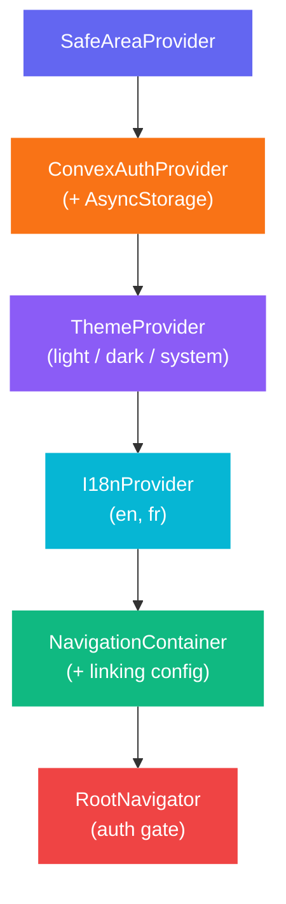
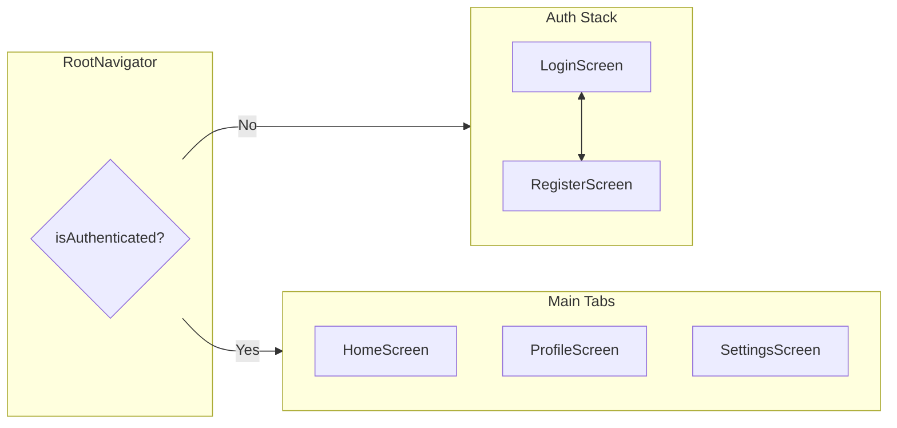
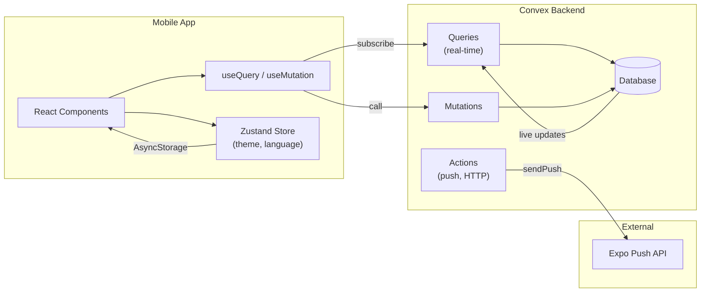
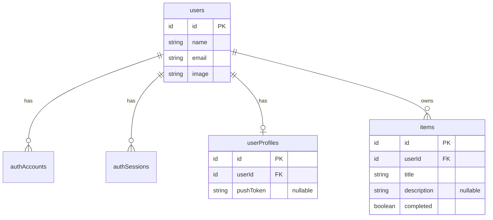
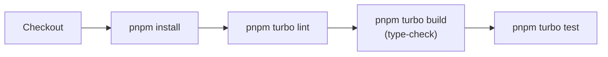
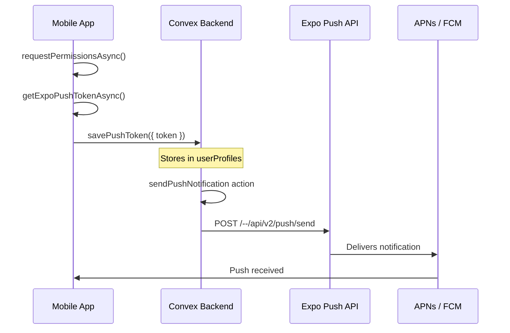

<p align="center">
  
</p>

<h1 align="center">AppBoilerplate</h1>

<p align="center">
  A production-ready monorepo template for <strong>React Native (Expo)</strong> + <strong>Convex</strong> apps.<br />
  Fork it, rename it, ship it.
</p>

<p align="center">
  
  
  
  
  
</p>

---

## Table of Contents

- [Why This Boilerplate?](#why-this-boilerplate)
- [Key Features](#key-features)
- [Tech Stack](#tech-stack)
- [Architecture](#architecture)
  - [Monorepo Layout](#monorepo-layout)
  - [Provider Stack](#provider-stack)
  - [Navigation Flow](#navigation-flow)
  - [Data Flow](#data-flow)
  - [Feature Module Structure](#feature-module-structure)
  - [Database Schema](#database-schema)
- [Prerequisites](#prerequisites)
- [Cross-Platform Setup Guide](#cross-platform-setup-guide)
- [Getting Started](#getting-started)
  - [1. Create Your Project](#1-create-your-project)
  - [2. Rename the App](#2-rename-the-app)
  - [3. Install Dependencies](#3-install-dependencies)
  - [4. Configure Environment](#4-configure-environment)
  - [5. Start the Convex Backend (Docker)](#5-start-the-convex-backend-docker)
  - [6. Start the Mobile App](#6-start-the-mobile-app)
- [Available Scripts](#available-scripts)
- [Environment Variables](#environment-variables)
- [Testing](#testing)
- [CI/CD](#cicd)
- [Push Notifications](#push-notifications)
- [Deep Linking](#deep-linking)
- [Theming](#theming)
- [Internationalization (i18n)](#internationalization-i18n)
- [Asset Pipeline](#asset-pipeline)
- [Architecture Decision Records](#architecture-decision-records)
- [Product Management](#product-management)
- [Troubleshooting](#troubleshooting)
- [Contributing](#contributing)
- [Security](#security)
- [License](#license)

---

## Why This Boilerplate?

Starting a React Native app with a real-time backend shouldn't take a week of config wrangling. This template gives you a **fully wired, tested, CI-ready starting point** so you can focus on your product, not your plumbing.

Fork → rename → `pnpm install` → `pnpm dev` → you're building features.

## Key Features

| Category | What you get |
|----------|-------------|
| **Auth** | Email/password sign-up & sign-in via Convex Auth, OAuth-ready |
| **Real-time data** | Every query is a live query — UI updates automatically |
| **Navigation** | Stack + bottom tabs with typed params and deep linking |
| **Theming** | Light / dark / system with persisted preference |
| **i18n** | English + French out of the box, device locale detection |
| **Push notifications** | `expo-notifications` + Convex backend action for sending |
| **Deep linking** | Custom scheme (`appboilerplate://`) + Universal/App Links |
| **Testing** | Jest + RNTL (mobile), Vitest + convex-test (backend), Maestro (E2E) |
| **CI/CD** | GitHub Actions: lint + type-check + test on every PR, nightly E2E |
| **SVG assets** | Single-source SVGs → generated PNGs via `sharp` |
| **Splash screen** | Controlled hide via `expo-splash-screen` |
| **Env tiers** | `.env.development` / `.env.staging` / `.env.production` |

---

## Tech Stack

| Layer | Technology | Version |
|-------|-----------|---------|
| **Mobile framework** | Expo (dev client) | SDK 53 |
| **UI** | React Native | 0.79.2 |
| **Language** | TypeScript | 5.8 |
| **Backend** | Convex | 1.17 |
| **Auth** | @convex-dev/auth (Password) | 0.0.91 |
| **Navigation** | React Navigation (native stack + bottom tabs) | 7.x |
| **Client state** | Zustand + persist middleware | 5.x |
| **i18n** | react-i18next + expo-localization | 16.x / 55.x |
| **Push** | expo-notifications | — |
| **Monorepo** | Turborepo + pnpm | 2.5 / 9.x |
| **Linting** | ESLint + Prettier | 8.x / 3.x |
| **Mobile tests** | Jest 29 + jest-expo + React Native Testing Library | — |
| **Backend tests** | Vitest + convex-test + edge-runtime | 4.x |
| **E2E tests** | Maestro | — |
| **CI** | GitHub Actions | — |

---

## Architecture

### Monorepo Layout

```
AppBoilerplate/
├── apps/
│   └── mobile/                 # Expo React Native app
│       ├── assets/             #   Generated PNGs (icon, splash)
│       │   └── source/         #   Source SVGs (single source of truth)
│       ├── convex/             #   Type stubs for CI (see note below)
│       │   └── _generated/     #   Committed stubs so tsc passes in CI
│       ├── scripts/            #   Asset generation script
│       ├── src/
│       │   ├── app.tsx         #   Root component + provider stack
│       │   ├── navigators/     #   React Navigation setup + deep linking
│       │   ├── features/       #   Feature modules (auth, home, profile, settings)
│       │   └── shared/         #   Theme, i18n, store, env, notifications
│       ├── app.config.ts       #   Dynamic Expo config (reads .env.{APP_ENV})
│       ├── eas.json            #   EAS Build profiles
│       └── jest.config.js      #   Jest config with pnpm compat fixes
├── packages/
│   └── backend/                # Convex backend
│       ├── convex/
│       │   ├── auth.ts         #   Convex Auth config (Password provider)
│       │   ├── schema.ts       #   Database schema (authTables + app tables)
│       │   ├── http.ts         #   HTTP router for auth callbacks
│       │   ├── _utils/         #   Shared helpers (requireAuthUserId)
│       │   ├── items/          #   Sample CRUD module (queries + mutations + tests)
│       │   └── notifications/  #   Push notification mutations/actions
│       └── vitest.config.ts    #   Vitest with edge-runtime
├── docs/
│   ├── adr/                    # Architecture Decision Records (13 ADRs)
│   └── pm/                     # Product management (vision, roadmap, improvements)
├── .github/
│   └── workflows/
│       ├── ci.yml              # Lint + type-check + test on every PR
│       └── e2e.yml             # Nightly Maestro E2E on iOS Simulator
├── .maestro/                   # Maestro E2E flow files
├── CONTRIBUTING.md              # Contribution guide (branch, commit, PR, review)
├── SECURITY.md                 # Security policy and checklist
├── turbo.json                  # Turborepo task config
├── pnpm-workspace.yaml         # Workspace definitions
└── .npmrc                      # node-linker=hoisted (critical for RN)
```

### Provider Stack

The app wraps the component tree in a layered provider stack. Each provider adds a capability that all descendants can access via hooks.



### Navigation Flow

`RootNavigator` reads the session from `useConvexAuth()` and renders either the **Auth stack** or the **Main tabs** — never both at the same time.



### Data Flow

All server state flows through Convex. Client-only preferences are managed by Zustand.



### Feature Module Structure

Each feature is a self-contained directory under `src/features/`. Shared utilities live in `src/shared/`.

```
src/features/{feature}/
├── screens/          # Full-screen components
├── components/       # Feature-specific UI components
├── hooks/            # Feature-specific hooks (useItems, etc.)
└── __tests__/        # Co-located tests
```

**Rule**: features import from `shared/` — never from other features.

```
src/shared/
├── theme/            # Colors, spacing, typography, ThemeProvider
├── i18n/             # i18next setup, locales (en.json, fr.json), I18nProvider
├── store/            # Zustand stores (useSettingsStore)
├── env/              # Typed environment variables
└── notifications/    # useNotifications hook
```

### Database Schema



> `authAccounts`, `authSessions`, `authVerificationCodes`, `authVerifiers`, and `authRateLimits` are managed by `@convex-dev/auth` and spread into the schema via `...authTables`.

---

## Prerequisites

Before you begin, make sure you have:

| Tool | Version | Install |
|------|---------|---------|
| **Node.js** | 18+ (22 recommended) | [nodejs.org](https://nodejs.org) or `nvm install 22` |
| **pnpm** | 9+ | `corepack enable && corepack prepare pnpm@9 --activate` |
| **Xcode** | 15+ (for iOS) | Mac App Store |
| **Android Studio** | Latest (for Android) | [developer.android.com](https://developer.android.com/studio) |
| **Docker** | 20+ | [docker.com](https://docs.docker.com/get-docker/) |

> **iOS only?** Skip Android Studio. **Android only?** Skip Xcode.

## Cross-Platform Setup Guide

For a full OS-specific setup and run guide (macOS, Windows, Linux), see [`docs/INSTALLATION.md`](docs/INSTALLATION.md).

---

## Getting Started

### 1. Create Your Project

Click **"Use this template"** on GitHub, or clone directly:

```bash
git clone https://github.com/diaspoai/AppBoilerplate.git my-app
cd my-app
rm -rf .git && git init  # Start with a fresh history (macOS/Linux)
```

```powershell
git clone https://github.com/diaspoai/AppBoilerplate.git my-app
cd my-app
Remove-Item -Recurse -Force .git; git init  # Start with a fresh history (Windows PowerShell)
```

### 2. Rename the App

Replace the boilerplate identifiers with your own app name. The table below lists **every file** that needs updating:

#### App name & slug

Find-and-replace `AppBoilerplate` → `YourApp` and `app-boilerplate` → `your-app`:

| File | What to change |
|------|----------------|
| `package.json` (root) | `"name": "app-boilerplate"` |
| `apps/mobile/app.config.ts` | `appNames` object (`AppBoilerplate (Dev)`, etc.) and `slug: 'app-boilerplate'` |
| `apps/mobile/assets/source/splash.svg` | `<text>AppBoilerplate</text>` — then run `pnpm generate:assets` |
| `apps/mobile/src/shared/i18n/locales/en.json` | `"appName": "AppBoilerplate"` |
| `apps/mobile/src/shared/i18n/locales/fr.json` | `"appName": "AppBoilerplate"` |

#### Bundle ID / package name

Replace `com.appboilerplate.app` with your reverse-domain identifier (e.g. `com.yourcompany.yourapp`):

| File | What to change |
|------|----------------|
| `apps/mobile/app.config.ts` | `bundleIdentifier` (iOS) and `package` (Android) |
| `.maestro/auth/login.yaml` | `appId:` line |
| `.maestro/auth/register.yaml` | `appId:` line |
| `.maestro/home/browse-items.yaml` | `appId:` line |

#### Deep link scheme & domain

Replace `appboilerplate://` with your custom scheme and `appboilerplate.dev` with your domain:

| File | What to change |
|------|----------------|
| `apps/mobile/src/navigators/linking.ts` | `prefixes` array and comments |
| `apps/mobile/app.config.ts` | `associatedDomains` (iOS) and `intentFilters` host (Android) |

#### Quick one-liner (macOS/Linux)

```bash
# Replace identifiers across the entire project (review the diff afterwards!)
LC_ALL=C find . -type f \
  -not -path '*/node_modules/*' \
  -not -path '*/.git/*' \
  -not -path '*/pnpm-lock.yaml' \
  -not -name '*.png' \
  -exec sed -i '' \
    -e 's/AppBoilerplate/YourApp/g' \
    -e 's/app-boilerplate/your-app/g' \
    -e 's/com\.appboilerplate\.app/com.yourcompany.yourapp/g' \
    -e 's/com\.appboilerplate\.mobile/com.yourcompany.yourapp/g' \
    -e 's/appboilerplate:\/\//yourapp:\/\//g' \
    -e 's/appboilerplate\.dev/yourapp.com/g' {} +
```

> After renaming, regenerate assets: `cd apps/mobile && pnpm generate:assets`

#### Quick one-liner (Windows PowerShell)

```powershell
Get-ChildItem -Recurse -File | Where-Object {
  $_.FullName -notmatch '\\node_modules\\|\\.git\\' -and
  $_.Name -ne 'pnpm-lock.yaml' -and
  $_.Extension -ne '.png'
} | ForEach-Object {
  $content = Get-Content $_.FullName -Raw
  $content = $content.Replace('AppBoilerplate', 'YourApp')
  $content = $content.Replace('app-boilerplate', 'your-app')
  $content = $content.Replace('com.appboilerplate.app', 'com.yourcompany.yourapp')
  $content = $content.Replace('com.appboilerplate.mobile', 'com.yourcompany.yourapp')
  $content = $content.Replace('appboilerplate://', 'yourapp://')
  $content = $content.Replace('appboilerplate.dev', 'yourapp.com')
  Set-Content $_.FullName $content
}
```

### 3. Install Dependencies

```bash
pnpm install
```

> This uses `node-linker=hoisted` (set in `.npmrc`) — required for React Native / Metro / Jest compatibility with pnpm.

### 4. Configure Environment

Copy the example env files and fill in your values:

```bash
# Mobile app
cp apps/mobile/.env.development.example apps/mobile/.env.development
```

```powershell
# Mobile app (Windows PowerShell)
Copy-Item apps/mobile/.env.development.example apps/mobile/.env.development
```

Edit `apps/mobile/.env.development`:

```bash
APP_ENV=development
CONVEX_URL=http://127.0.0.1:3210   # Self-hosted Convex (from step 5)
EAS_PROJECT_ID=                      # From `eas init` (optional)
```

### 5. Start the Convex Backend (Docker)

This boilerplate uses a **self-hosted Convex** instance running locally via Docker. No cloud account needed.

#### Start the Convex containers

```bash
cd packages/backend

# Download the official docker-compose file (first time only)
npx degit get-convex/convex-backend/self-hosted/docker/docker-compose.yml docker-compose.yml

# Pull images and start
docker compose pull
docker compose up -d
```

This starts two containers:

| Container | Port | Purpose |
|-----------|------|---------|
| **convex-backend** | `3210` | API + real-time sync |
| **convex-dashboard** | `6791` | Admin dashboard UI |

#### Generate the admin key

```bash
docker compose exec backend ./generate_admin_key.sh
```

Save the output — you'll need it in the next step.

#### Connect the CLI to your self-hosted instance

Create `packages/backend/.env.local` (gitignored):

```bash
CONVEX_SELF_HOSTED_URL=http://127.0.0.1:3210
CONVEX_SELF_HOSTED_ADMIN_KEY=<paste the admin key from above>
```

#### Push schema and start dev mode

```bash
# From packages/backend — syncs schema + functions and generates _generated/ types
npx convex dev
```

The CLI reads `.env.local` automatically and targets your local Docker instance instead of Convex Cloud.

#### Set up Convex Auth (one-time)

```bash
npx @convex-dev/auth
```

This generates `JWT_PRIVATE_KEY` and `JWKS`. For self-hosted, these are stored as environment variables in the Convex dashboard at [http://localhost:6791](http://localhost:6791).

> **Keep `npx convex dev` running** — it watches for file changes and syncs them to your local Convex instance in real time.

#### Convex Cloud (alternative)

If you prefer Convex Cloud over self-hosting, skip Docker and run:

```bash
cd packages/backend
npx convex dev
```

This will prompt you to log in to [convex.dev](https://convex.dev) (free tier), create a project, and generate a cloud URL. Use that URL as `CONVEX_URL` in your `.env.development`.

### 6. Start the Mobile App

In a separate terminal:

```bash
# From the repo root
pnpm dev
```

Or start just the mobile app:

```bash
# Build the dev client (first time only)
cd apps/mobile
pnpm expo prebuild --platform ios --clean
pnpm expo run:ios

# Subsequent runs — start the Metro bundler
pnpm expo start
```

Scan the QR code with Expo Go, or press `i` for iOS Simulator / `a` for Android Emulator.

> On Windows, use Android development (`pnpm expo run:android`) because iOS simulators require macOS + Xcode.

---

## Available Scripts

Run these from the **repo root**:

| Command | Description |
|---------|-------------|
| `pnpm dev` | Start all packages in dev mode (Turborepo) |
| `pnpm build` | Type-check all packages |
| `pnpm lint` | Lint all packages (ESLint) |
| `pnpm test` | Run all test suites |
| `pnpm format` | Format all files (Prettier) |

Run these from **`apps/mobile/`**:

| Command | Description |
|---------|-------------|
| `pnpm expo start` | Start Metro bundler |
| `pnpm expo prebuild --platform ios` | Generate native iOS project |
| `pnpm expo run:ios` | Build and run on iOS Simulator |
| `pnpm expo run:android` | Build and run on Android Emulator |
| `pnpm test` | Run Jest tests |
| `pnpm generate:assets` | Regenerate PNGs from SVG sources |

Run these from **`packages/backend/`**:

| Command | Description |
|---------|-------------|
| `pnpm dev` | Start Convex dev server (watch mode) |
| `pnpm test` | Run Vitest backend tests |
| `pnpm lint` | Lint backend code |

---

## Environment Variables

### Mobile App (`apps/mobile/.env.{APP_ENV}`)

| Variable | Required | Description |
|----------|----------|-------------|
| `APP_ENV` | Yes | `development`, `staging`, or `production` |
| `CONVEX_URL` | Yes | `http://127.0.0.1:3210` (self-hosted) or your Convex Cloud URL |
| `EAS_PROJECT_ID` | No | EAS Build project ID (from `eas init`) |

Three example files are provided:

- `.env.development.example` — local development
- `.env.staging.example` — staging builds
- `.env.production.example` — production builds

### Convex Backend — CLI (`packages/backend/.env.local`)

| Variable | Required | Description |
|----------|----------|-------------|
| `CONVEX_SELF_HOSTED_URL` | Yes (self-hosted) | `http://127.0.0.1:3210` |
| `CONVEX_SELF_HOSTED_ADMIN_KEY` | Yes (self-hosted) | Generated by `./generate_admin_key.sh` |

> When using Convex Cloud instead, omit these — the CLI uses cloud credentials from `npx convex dev` login.

### Convex Backend — Auth (set in Convex dashboard)

| Variable | Required | Description |
|----------|----------|-------------|
| `JWT_PRIVATE_KEY` | Yes | Generated by `npx @convex-dev/auth` |
| `JWKS` | Yes | Generated by `npx @convex-dev/auth` |
| `SITE_URL` | No | Your app URL (needed for OAuth callbacks) |

Access the self-hosted dashboard at [http://localhost:6791](http://localhost:6791) to manage environment variables.

---

## Testing

### Mobile (Jest + React Native Testing Library)

```bash
cd apps/mobile
pnpm test                      # Run all tests
pnpm test -- --watch           # Watch mode
pnpm test -- ItemRow           # Run tests matching "ItemRow"
```

Tests live next to the code they test:

```
src/features/home/__tests__/ItemRow.test.tsx
src/shared/store/__tests__/useSettingsStore.test.ts
```

### Backend (Vitest + convex-test)

```bash
cd packages/backend
pnpm test                      # Run all tests
```

> **Note**: Backend tests require `convex/_generated/` to exist. Run `npx convex dev` at least once first. Tests use `describe.skipIf(!generatedExists)` to skip gracefully in CI when generated types aren't available.

Tests live next to the Convex functions:

```
convex/items/__tests__/queries.test.ts
convex/items/__tests__/mutations.test.ts
```

### E2E (Maestro)

```bash
# Build the dev client first
cd apps/mobile
pnpm expo prebuild --platform ios --clean
pnpm expo run:ios

# Run all E2E flows
maestro test .maestro/
```

Flows:

| Flow | What it tests |
|------|---------------|
| `.maestro/auth/register.yaml` | Register a new account |
| `.maestro/auth/login.yaml` | Sign in with existing credentials |
| `.maestro/home/browse-items.yaml` | Create, toggle, and delete an item |

---

## CI/CD

Two GitHub Actions workflows run automatically:

### `ci.yml` — every push & PR to `main`



- Runs on `ubuntu-latest`
- Concurrency group cancels in-progress runs for the same ref

### `e2e.yml` — nightly (02:00 UTC) + manual dispatch

1. Builds the Expo dev client for iOS Simulator via `xcodebuild`
2. Boots an iPhone 16 simulator
3. Installs the `.app` and runs all Maestro flows

---

## Push Notifications

### How it works



### Extending

The `useNotifications()` hook in `shared/notifications/useNotifications.ts` sets up two listeners:

- **Foreground listener** — notification received while app is open
- **Response listener** — user tapped a notification

Both are stubbed with comments showing where to add your logic (badge updates, deep navigation, etc.).

To send a push from the backend:

```typescript
await ctx.runAction(internal.notifications.actions.sendPushNotification, {
  userId,
  title: 'New item shared!',
  body: 'Someone shared an item with you.',
  data: { screen: 'home' },
});
```

---

## Deep Linking

### Supported URLs

| URL | Destination |
|-----|-------------|
| `appboilerplate://login` | Auth → LoginScreen |
| `appboilerplate://register` | Auth → RegisterScreen |
| `appboilerplate://home` | Main → HomeScreen |
| `appboilerplate://profile` | Main → ProfileScreen |
| `appboilerplate://settings` | Main → SettingsScreen |
| `https://appboilerplate.dev/home` | Main → HomeScreen (Universal Link) |

### Testing deep links locally

```bash
# iOS Simulator
npx uri-scheme open appboilerplate://home --ios

# Android Emulator
adb shell am start -W -a android.intent.action.VIEW -d "appboilerplate://home"
```

### Universal Links / App Links (production)

For verified domain links (`https://appboilerplate.dev`), you need to host:

- **iOS**: `/.well-known/apple-app-site-association`
- **Android**: `/.well-known/assetlinks.json`

See [ADR-0012](docs/adr/0012-deep-linking-universal-app-links.md) for full details.

---

## Theming

The app supports **light**, **dark**, and **system** themes. The preference is persisted to `AsyncStorage` via Zustand.

### Using theme values in components

```tsx
import { useTheme } from '@/shared/theme/ThemeProvider';

function MyComponent() {
  const { colors, spacing, typography } = useTheme();

  return (
    <View style={{ backgroundColor: colors.background, padding: spacing.md }}>
      <Text style={[typography.h1, { color: colors.textPrimary }]}>
        Hello
      </Text>
    </View>
  );
}
```

### Brand colours

| Token | Light | Dark |
|-------|-------|------|
| `primary` | `#6366F1` (Indigo) | `#818CF8` (Indigo light) |
| `background` | `#FFFFFF` | `#111827` (Gray 900) |
| `textPrimary` | `#111827` | `#FFFFFF` |
| `error` | `#EF4444` | `#EF4444` |

Edit `src/shared/theme/colors.ts` to customise the palette.

---

## Internationalization (i18n)

Two locales ship out of the box: **English** (`en`) and **French** (`fr`). The app detects the device locale on first launch and falls back to English.

### Adding a new language

1. Create `src/shared/i18n/locales/es.json` (copy from `en.json`)
2. Translate the keys
3. Add `'es'` to `SUPPORTED_LANGUAGES` in `src/shared/i18n/index.ts`

### Using translations in components

```tsx
import { useTranslation } from 'react-i18next';

function MyScreen() {
  const { t } = useTranslation();
  return <Text>{t('home.title')}</Text>;
}
```

The user's language preference is persisted via Zustand (`useSettingsStore`).

---

## Asset Pipeline

Source SVGs in `assets/source/` are the single source of truth for app icons and splash screens.

```bash
# Regenerate PNGs from SVGs
cd apps/mobile
pnpm generate:assets
```

| Source SVG | Generated PNGs |
|-----------|----------------|
| `assets/source/icon.svg` | `assets/icon.png` (1024×1024), `assets/adaptive-icon.png` (1024×1024) |
| `assets/source/splash.svg` | `assets/splash.png` (1242×2688) |

Generated PNGs are committed to Git so the app works immediately after cloning.

See [ADR-0008](docs/adr/0008-svg-first-asset-pipeline.md) for the rationale.

---

## Architecture Decision Records

Every significant architectural choice is documented in [`docs/adr/`](docs/adr/README.md):

| ADR | Decision |
|-----|----------|
| [0001](docs/adr/0001-expo-dev-client-over-bare-rn.md) | Expo dev client over bare React Native |
| [0002](docs/adr/0002-convex-as-backend.md) | Convex as the backend platform |
| [0003](docs/adr/0003-react-navigation-over-expo-router.md) | React Navigation over Expo Router |
| [0004](docs/adr/0004-turborepo-pnpm-monorepo.md) | Turborepo + pnpm monorepo |
| [0005](docs/adr/0005-flat-feature-modules.md) | Flat Feature Modules architecture |
| [0006](docs/adr/0006-convex-auth.md) | Convex Auth for authentication |
| [0007](docs/adr/0007-zustand-client-state.md) | Zustand for client-side state |
| [0008](docs/adr/0008-svg-first-asset-pipeline.md) | SVG-first asset pipeline |
| [0009](docs/adr/0009-testing-strategy.md) | Testing strategy (Jest + Vitest + Maestro) |
| [0010](docs/adr/0010-github-actions-ci.md) | GitHub Actions for CI/CD |
| [0011](docs/adr/0011-push-notifications-expo.md) | Expo Notifications for push |
| [0012](docs/adr/0012-deep-linking-universal-app-links.md) | Deep linking with Universal/App Links |
| [0013](docs/adr/0013-template-repo-over-cli.md) | Template repo over interactive CLI |

---

## Product Management

Product strategy, roadmap, and improvement proposals live in [`docs/pm/`](docs/pm/README.md):

| Document | What it covers |
|----------|---------------|
| [Product Vision](docs/pm/PRODUCT_VISION.md) | Mission, North Star Metric, target users, competitive landscape |
| [Roadmap](docs/pm/ROADMAP.md) | 22 RICE-scored features across 3 quarters, MoSCoW prioritisation |
| [Improvements](docs/pm/IMPROVEMENTS.md) | 20 detailed proposals (IMP-001 → IMP-020) with effort estimates |
| [Feature Metrics](docs/pm/FEATURE_SUCCESS_METRICS.md) | Success metrics per feature, fork-to-feature funnel |

### Improvement Priorities at a Glance

| Priority | Examples |
|----------|---------|
| **P0** | Error boundary, settings UI (theme/language toggles), form validation |
| **P1** | Shared component library, Sentry scaffold, profile screen, offline handling |
| **P2** | Android CI/E2E, onboarding flow, accessibility audit |
| **P3** | OAuth examples, RTL support, performance monitoring |

See the full [ROADMAP.md](docs/pm/ROADMAP.md) for RICE scores and quarterly plans.

---

## Troubleshooting

### `pnpm install` fails with React Native errors

Ensure `.npmrc` contains `node-linker=hoisted`. This is critical for Metro and Jest to resolve modules through pnpm's virtual store.

### `tsc --noEmit` fails with "cannot find module 'convex/_generated/...'"

The type stubs in `apps/mobile/convex/_generated/` must exist. They're committed to the repo — if missing, re-clone or run `git checkout -- apps/mobile/convex/_generated/`.

### Backend tests are skipped

Backend tests require `packages/backend/convex/_generated/` (produced by `npx convex dev`). Run the dev server at least once to generate these types. Tests use `describe.skipIf(!generatedExists)` — they'll run automatically once the directory exists.

### Jest transform errors with pnpm

The `transformIgnorePatterns` in `jest.config.js` includes `\\.pnpm` in the negative lookahead. This ensures Jest enters pnpm's virtual store directory and correctly transforms React Native packages. Don't remove it.

### `expo prebuild` fails

```bash
# Clean and rebuild
cd apps/mobile
rm -rf ios android
pnpm expo prebuild --platform ios --clean
```

```powershell
# Clean and rebuild (Windows PowerShell)
cd apps/mobile
Remove-Item -Recurse -Force ios, android
pnpm expo prebuild --platform android --clean
```

### `jest-expo` version mismatch

`jest-expo` version must match Expo SDK version. For SDK 53, use `jest-expo@~53`. Running `jest-expo@55` with SDK 53 will cause cryptic failures.

### AsyncStorage errors in tests

The Jest config maps `@react-native-async-storage/async-storage` to its built-in mock. If you see native module errors, verify the `moduleNameMapper` entry in `jest.config.js`.

### Convex Auth "Unauthenticated" errors

1. Ensure `npx @convex-dev/auth` was run to set up `JWT_PRIVATE_KEY` and `JWKS` in your Convex dashboard
2. Ensure `SITE_URL` is set in the Convex dashboard if using OAuth
3. Check that `ConvexAuthProvider` wraps your app with `storage={AsyncStorage}`

### Push notifications not working on iOS Simulator

Push notifications require a physical device. The Expo push token registration will fail silently on simulators. Test on a real device.

---

## Contributing

We welcome contributions! See [**CONTRIBUTING.md**](CONTRIBUTING.md) for the full guide, including:

- Branch naming conventions and commit message format
- Code standards (TypeScript, React Native, Convex)
- Testing requirements per layer
- Pull request process and review checklist
- When and how to write Architecture Decision Records

**Quick start**:

```bash
git checkout -b feat/my-feature
# Make changes...
pnpm lint && pnpm build && pnpm test   # Must pass before pushing
git commit -m "feat(scope): description"
# Open a Pull Request
```

---

## Security

See [**SECURITY.md**](SECURITY.md) for:

- How to report vulnerabilities (private disclosure)
- Security architecture (auth, authorization, data, secrets)
- Secrets inventory and where they live
- Security checklist for forked projects
- Known limitations and mitigations

---

## License

This project is provided as a template. Add your preferred license after forking.
